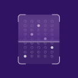

<!-- PROJECT LOGO -->
<br />
<div align="center">
  <a href="https://gitlab.informatika.org/k-02-09/omrekap.git">
    
  </a>

  <h3 align="center">OMRekap</h3>

  <p align="center">
    Aplikasi Rekapitulasi Pemilihan Umum 
    <br />
    <a href="https://drive.google.com/file/d/1Z7-iwjspu0tJr2c9R2ZTLW68enhBc1zD/view?usp=drive_link"><strong>Explore the docs »</strong></a>
    <br />
  </p>
</div>

<!-- TABLE OF CONTENTS -->
<details>
  <summary>Table of Contents</summary>
  <ol>
    <li>
      <a href="#about-the-project">About The Project</a>
      <ul>
        <li><a href="#built-with">Built With</a></li>
      </ul>
    </li>
    <li>
      <a href="#getting-started">Getting Started</a>
      <ul>
        <li><a href="#prerequisites">Prerequisites</a></li>
        <li><a href="#installation">Installation</a></li>
      </ul>
    </li>
    <li><a href="#Development">Development</a></li>
    <li><a href="#usage">Usage</a></li>
    <li><a href="#contact">Contact</a></li>
    <li><a href="#acknowledgments">Acknowledgments</a></li>
  </ol>
</details>


## Development
### Clone the repository
```bash
git clone https://gitlab.informatika.org/k-02-09/omrekap
```

### Run Unit Test
```bash
./gradlew test
```

### Code Formatting
```bash
./gradlew spotlessApply
```

### Changing Formatting Configuration
* Update spotless.gradle based on Ktlint rules [here](https://pinterest.github.io/ktlint/0.50.0/rules/configuration-ktlint/)
* Clean gradle cache
```bash
./gradlew clean 
```

<p align="right">(<a href="#readme-top">back to top</a>)</p>

# Built With
* [](https://developer.android.com/)
* [](https://kotlinlang.org/)
* [](https://gradle.org/)
* [](https://opencv.org/)

