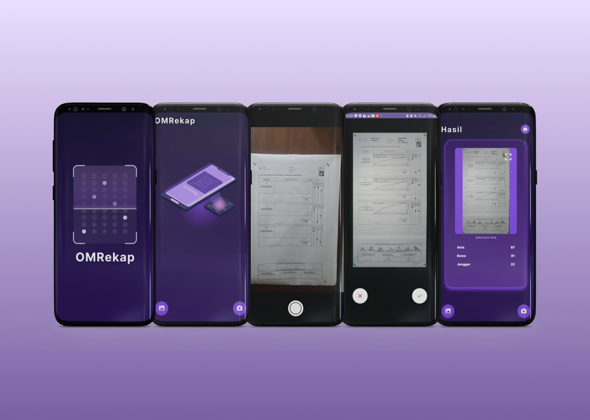

<!-- PROJECT LOGO -->
<br />
<div align="center">
  <a href="https://gitlab.informatika.org/k-02-09/omrekap.git">
    
  </a>

  <h3 align="center">OMRekap</h3>

  <p align="center">
    Aplikasi Rekapitulasi Pemilihan Umum 
    <br />
    <a href="https://drive.google.com/file/d/17xJabhFr3tFBLDdku4rONEyfcQLBBodp/view?usp=sharing"><strong>Explore the docs »</strong></a>
    <br />
  </p>
</div>

[](https://forthebadge.com) [](https://forthebadge.com) [](https://forthebadge.com)
<br />
[](https://developer.android.com/) [](https://kotlinlang.org/) [](https://gradle.org/) [](https://opencv.org/)

<!-- TABLE OF CONTENTS -->
<details>
  <summary>Table of Contents</summary>
  <ol>
    <li>
      <a href="#about-the-project">About The Project</a>
    </li>
    <li>
      <a href="#features">Features</a>
    </li>
    <li><a href="#how-to-use">How To Use</a></li>
    <li><a href="#development">Development</a></li>
    <li><a href="#contributors">Contributors</a></li>
    <li><a href="#acknowledgments">Acknowledgments</a></li>
  </ol>
</details>


# About The Project
OMRekap adalah aplikasi rekapitulasi pemilihan umum yang dibuat untuk memudahkan proses rekapitulasi suara pada pemilihan umum.
Aplikasi ini dibuat menggunakan bahasa pemrograman Kotlin dan menggunakan OpenCV untuk mendeteksi dan mengenali lembar suara.



# Features
1. Mengambil foto kertas plano menggunakan kamera 📷 atau menggunakan galeri 🖼
2. Melihat hasil foto yang diambil pada halaman berikutnya
3. Mendeteksi dan mengenali lembar suara
4. Menampilkan hasil rekapitulasi suara
5. Menyimpan hasil rekapitulasi suara dalam bentuk foto 🖼 dan JSON 📃


# How To Use
1. Akses  halaman https://bit.ly/OMRekap  menggunakan browser.
2. Terdapat 2 folder pada drive tersebut. Anda dapat memilih menggunakan Universal Build dengn size .apk lebih besar atau memilih Slim Build dengan ukuran lebih kecil sesuai dengan arsitektur prosesor Anda.
3. Unduh file .apk yang tersedia di dalam folder tersebut ke perangkat Android.
4. Lakukan instalasi file .apk tersebut pada perangkat Android.

Sebagai alternatif, langkah-langkah berikut juga dapat dilakukan dalam instalasi aplikasi ini.
1. Akses halaman https://gitlab.informatika.org/k-02-09/omrekap.git  
2. Unduh source code berupa .zip atau .rar dari rilis tersebut.
3. Buka proyek tersebut menggunakan Android Studio.
4. Lakukan build dan jalankan aplikasi.

# Development
### Clone the repository
```bash
git clone https://gitlab.informatika.org/k-02-09/omrekap
```

### Run Unit Test
```bash
./gradlew test
```

### Code Formatting
```bash
./gradlew spotlessApply
```

### Changing Formatting Configuration
* Update spotless.gradle based on Ktlint rules [here](https://pinterest.github.io/ktlint/0.50.0/rules/configuration-ktlint/)
* Clean gradle cache
```bash
./gradlew clean 
```

# Contributors
<table>
    <tr>
      <td align="center" valign="top" width="14.28%"><a href="https://github.com/Altair16181"><br /><sub><b>Farhan Nabil Suryono</b></sub></a><br /><a href="https://github.com/codesandbox/codesandbox-client/issues?q=author%3ACompuIves" title="Bug reports">🐛</a> <a href="https://github.com/codesandbox/codesandbox-client/commits?author=CompuIves" title="Code">💻</a> <a href="#design-CompuIves" title="Design">🎨</a> <a href="https://github.com/codesandbox/codesandbox-client/commits?author=CompuIves" title="Documentation">📖</a> <a href="#infra-CompuIves" title="Infrastructure (Hosting, Build-Tools, etc)">🚇</a> <a href="https://github.com/codesandbox/codesandbox-client/pulls?q=is%3Apr+reviewed-by%3ACompuIves" title="Reviewed Pull Requests">👀</a> <a href="https://github.com/codesandbox/codesandbox-client/commits?author=CompuIves" title="Tests">⚠️</a> <a href="#tool-CompuIves" title="Tools">🔧</a></td>
      <td align="center" valign="top" width="14.28%"><a href="https://github.com/Enliven26"><br /><sub><b>Johanes Lee</b></sub></a><br /><a href="https://github.com/codesandbox/codesandbox-client/issues?q=author%3ACompuIves" title="Bug reports">🐛</a> <a href="https://github.com/codesandbox/codesandbox-client/commits?author=CompuIves" title="Code">💻</a> <a href="#design-CompuIves" title="Design">🎨</a> <a href="https://github.com/codesandbox/codesandbox-client/commits?author=CompuIves" title="Documentation">📖</a> <a href="#infra-CompuIves" title="Infrastructure (Hosting, Build-Tools, etc)">🚇</a> <a href="https://github.com/codesandbox/codesandbox-client/pulls?q=is%3Apr+reviewed-by%3ACompuIves" title="Reviewed Pull Requests">👀</a> <a href="https://github.com/codesandbox/codesandbox-client/commits?author=CompuIves" title="Tests">⚠️</a> <a href="#tool-CompuIves" title="Tools">🔧</a></td>
      <td align="center" valign="top" width="14.28%"><a href="https://github.com/dhanikanovlisa"><br /><sub><b>Dhanika Novlisariyanti</b></sub></a><br /><a href="https://github.com/codesandbox/codesandbox-client/issues?q=author%3ACompuIves" title="Bug reports">🐛</a> <a href="https://github.com/codesandbox/codesandbox-client/commits?author=CompuIves" title="Code">💻</a> <a href="#design-CompuIves" title="Design">🎨</a> <a href="https://github.com/codesandbox/codesandbox-client/commits?author=CompuIves" title="Documentation">📖</a> <a href="#infra-CompuIves" title="Infrastructure (Hosting, Build-Tools, etc)">🚇</a> <a href="https://github.com/codesandbox/codesandbox-client/pulls?q=is%3Apr+reviewed-by%3ACompuIves" title="Reviewed Pull Requests">👀</a> <a href="https://github.com/codesandbox/codesandbox-client/commits?author=CompuIves" title="Tests">⚠️</a> <a href="#tool-CompuIves" title="Tools">🔧</a></td>
      <td align="center" valign="top" width="14.28%"><a href="https://github.com/Genvictus"><br /><sub><b>Johann Christian Kandani</b></sub></a><br /><a href="https://github.com/codesandbox/codesandbox-client/issues?q=author%3ACompuIves" title="Bug reports">🐛</a> <a href="https://github.com/codesandbox/codesandbox-client/commits?author=CompuIves" title="Code">💻</a> <a href="#design-CompuIves" title="Design">🎨</a> <a href="https://github.com/codesandbox/codesandbox-client/commits?author=CompuIves" title="Documentation">📖</a> <a href="#infra-CompuIves" title="Infrastructure (Hosting, Build-Tools, etc)">🚇</a> <a href="https://github.com/codesandbox/codesandbox-client/pulls?q=is%3Apr+reviewed-by%3ACompuIves" title="Reviewed Pull Requests">👀</a> <a href="https://github.com/codesandbox/codesandbox-client/commits?author=CompuIves" title="Tests">⚠️</a> <a href="#tool-CompuIves" title="Tools">🔧</a></td>
      <td align="center" valign="top" width="14.28%"><a href="https://github.com/Michaelu670"><br /><sub><b>Michael Utama</b></sub></a><br /><a href="https://github.com/codesandbox/codesandbox-client/issues?q=author%3ACompuIves" title="Bug reports">🐛</a> <a href="https://github.com/codesandbox/codesandbox-client/commits?author=CompuIves" title="Code">💻</a> <a href="#design-CompuIves" title="Design">🎨</a> <a href="https://github.com/codesandbox/codesandbox-client/commits?author=CompuIves" title="Documentation">📖</a> <a href="#infra-CompuIves" title="Infrastructure (Hosting, Build-Tools, etc)">🚇</a> <a href="https://github.com/codesandbox/codesandbox-client/pulls?q=is%3Apr+reviewed-by%3ACompuIves" title="Reviewed Pull Requests">👀</a> <a href="https://github.com/codesandbox/codesandbox-client/commits?author=CompuIves" title="Tests">⚠️</a> <a href="#tool-CompuIves" title="Tools">🔧</a></td>
  </tbody>
</table>

# Acknowledgments
* [OpenCV](https://opencv.org/)
* [Kotlin](https://kotlinlang.org/)
* [Android](https://developer.android.com/)
